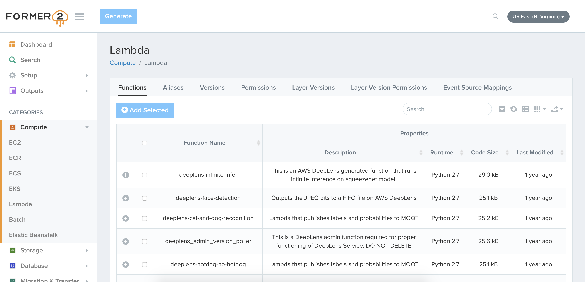
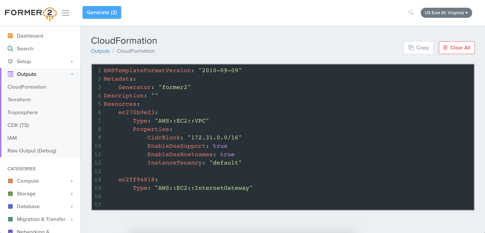

# Former2

[](RESOURCE_COVERAGE.md#cloudformation-resource-coverage) [](RESOURCE_COVERAGE.md#terraform-coverage)

> Generate CloudFormation / Terraform / Troposphere templates from your existing AWS resources






## Overview

Former2 allows you to generate Infrastructure-as-Code outputs from your existing resources within your AWS account. By making the relevant calls using the AWS JavaScript SDK, Former2 will scan across your infrastructure and present you with the list of resources for you to choose which to generate outputs for.

## Installation

Though [some AWS services](https://github.com/aws/aws-sdk-js/blob/master/SERVICES.md) do not require it, you will need to install the Former2 Helper browser extension in order to have support for all AWS services. The extension exists to bypass a lack of CORS on some services, such as S3 and IAM.

[Install Former2 Helper for Google Chrome](https://chrome.google.com/webstore/detail/former2-helper/fhejmeojlbhfhjndnkkleooeejklmigi)

[Install Former2 Helper for Mozilla Firefox](https://addons.mozilla.org/en-US/firefox/addon/former2-helper/)

[Install Former2 Helper for Microsoft Edge](https://microsoftedge.microsoft.com/addons/detail/okkjnfohglnomdbpimkcdkiojbeiedof)

Alternatively, you can [download and install](https://github.com/iann0036/former2-helper) the extension yourself.

## Usage

Visit [former2.com](https://former2.com/) to start.

You will need an [IAM key pair](https://docs.aws.amazon.com/IAM/latest/UserGuide/id_credentials_access-keys.html) to authenticate your requests. If you are not planning on importing resources directly, it is recommended that you provide only read access with these credentials and suggest you assign the [ReadOnlyAccess](https://console.aws.amazon.com/iam/home?#/policies/arn:aws:iam::aws:policy/ReadOnlyAccess) policy. If you intend to use the Import feature, you should grant appropriate permissions to create the stack.

Once authenticated you can navigate via the dashboard or sidebar to specific services, select the resources to add to your outputs and finally click the "Generate" button at the top of the screen.

The following outputs are currently supported:

* CloudFormation
* Terraform
* Troposphere
* CDK V1 (Cfn Primitives) - TypeScript, Python, Java, C#
* CDK V2 (Cfn Primitives) - TypeScript, Python, Java, C#
* CDK for Terraform - TypeScript
* Pulumi - TypeScript
* Diagram - embedded version of [draw.io](https://github.com/jgraph/drawio)

### Former2 CLI

A command-line version of Former2 with limited functionality is available for installation. For more information, see the [CLI instructions](cli/README.md).

### LocalStack Support

To enable support for use against [LocalStack](https://docs.localstack.cloud/references/network-troubleshooting/endpoint-url/) endpoints, enable the setting in the Settings page, ensure you are using the Former2 Helper extension/add-on, and add the following [configuration](https://docs.localstack.cloud/references/configuration/) to LocalStack:

_For Google Chrome:_
```
EXTRA_CORS_ALLOWED_ORIGINS=chrome-extension://fhejmeojlbhfhjndnkkleooeejklmigi
```

_For Mozilla Firefox:_
```
EXTRA_CORS_ALLOWED_ORIGINS=moz-extension://853c673f-1bd8-4226-a5ff-f1473f7b3d90
```

_For Microsoft Edge:_
```
EXTRA_CORS_ALLOWED_ORIGINS=extension://okkjnfohglnomdbpimkcdkiojbeiedof
```

## Security

Former2 does not create any resources within your AWS account.

Calls to the AWS service API endpoints are made either directly with the JavaScript SDK or via the browser extension (which also hits endpoints directly). Resource data and your credentials are kept entirely in memory and is never sent over the internet or anywhere else. The credentials are only used to sign requests to AWS endpoints. You should take care to remove any sensitive data (passwords etc.) when sharing your generated code/templates with others.

If you prefer not to use a publicly hosted site to use Former2, you can [host your own version](HOSTING.md) by running a HTTP server from the root of the repository. Extension support will also be available if you host on 127.0.0.1 or localhost, otherwise you can [modify the extension](HOSTING.md) as needed.

## Pricing

Though Former2 is free to access or use locally, some [AWS services](https://aws.amazon.com/secrets-manager/pricing/) have small charges associated with API calls so usage may attract an extra couple cents to your AWS bill.

## FAQ

**Does this replace Console Recorder?**

[Console Recorder](https://github.com/iann0036/AWSConsoleRecorder) still fills a certain gap and has features this tool does not support (such as Get/List outputs). I'll be maintaining both for as long as I can.

**I found an issue / I'm missing an output / Something's wrong. Can you help?**

If you find a bug or want to raise a feature request, please do so via [the issues page](https://github.com/iann0036/former2/issues).
